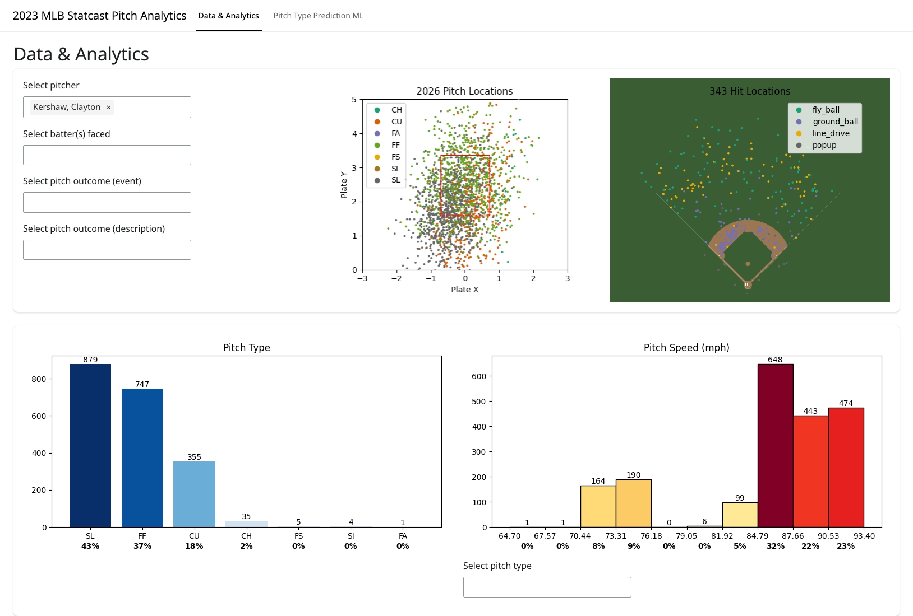

# MLB Data Analytics and Machine Learning Dashboard

<!-- ABOUT THE PROJECT -->
## About The Project

[](https://andrewleaventon.shinyapps.io/mlb-analysis/)

This project is a [data analytics and machine learning dashboard](https://andrewleaventon.shinyapps.io/mlb-analysis/) for the 2023 MLB season. On the analytics page, users are able to search and view specific pitches based on a number of filters. Vizualization and analytics on the resulting pitches are reactively displayed. The machine learning tab includes performance metrics models attempting to guess the pitch type thrown in the 2023 season. The webpage only includes the performance metrics, however the code for the modeling can be found in ```models.py```


### Built With
- Python
- [Shiny by Posit](https://shiny.posit.co/py/)

<!-- GETTING STARTED -->
## Getting Started

### Installation

1. Clone the repo
   ```sh
   git clone https://github.com/awl224/MLB-Pitching-Analysis.git
   ```
2. Install Python libraries
   ```sh
   pip install -r requirements.txt
   ```
3. Run Models
    ```sh
   python models.py
   ```
4. Visit dashboard [live webpage](https://andrewleaventon.shinyapps.io/mlb-analysis/)

<!-- CONTACT -->
## Contact

Andrew Leaventon
- andrewleaventon@gmail.com
- [LinkedIn](https://www.linkedin.com/in/andrew-leaventon/)

Project Link: [https://github.com/awl224/MLB-Pitching-Analysis](https://github.com/awl224/MLB-Pitching-Analysis)